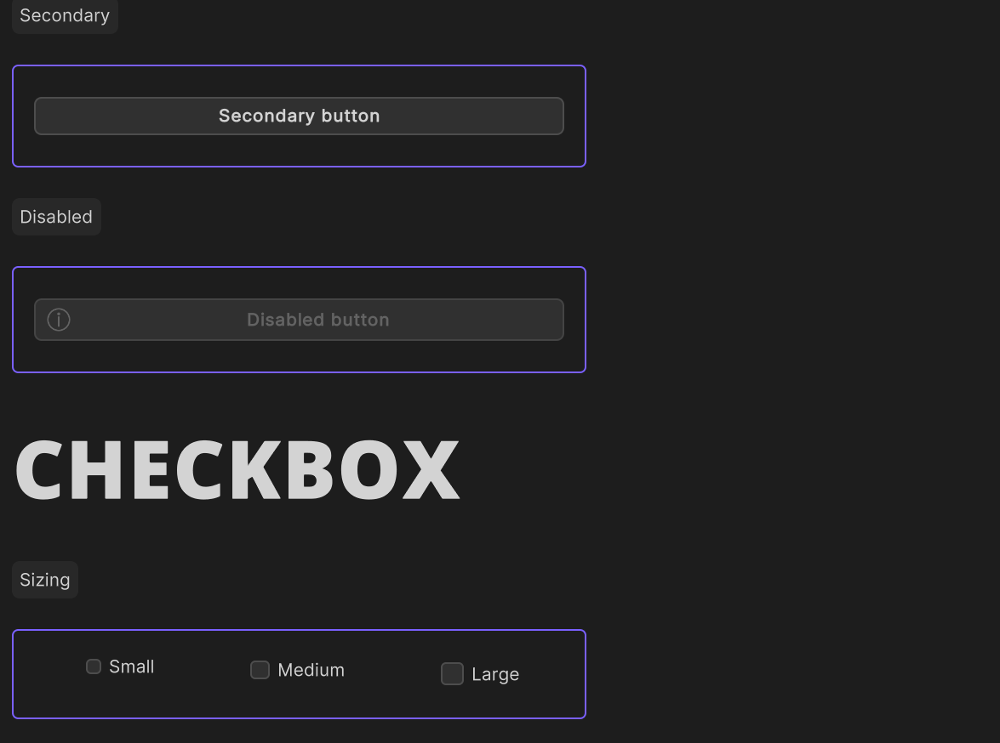
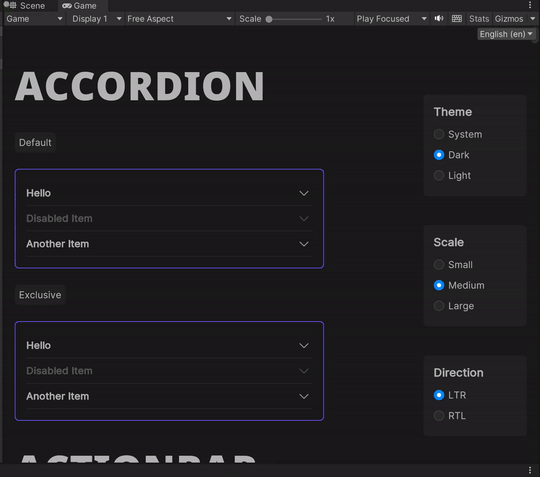

# Accessibility

Accessibility support in game engines can be more complex than other platforms, since there are no universal standards for
how to implement accessibility features. However, App UI provides a few features that can help make your UI more
accessible to users with disabilities.

## Focus Outline

The focus outline is a visual indicator that shows which UI element is currently focused.
This indicator is only visible when the UI element has been focused via a keyboard navigation.

<p align="center">
  
</p>

## Keyboard navigation

One key feature for accessibility is keyboard navigation. This feature allows users to navigate through UI elements using
the <kbd>Tab</kbd> and <kbd>Shift</kbd>+<kbd>Tab</kbd> keys.
App UI supports keyboard navigation through the UI-Toolkit Focus Ring. When an element is focused, it is outlined with a focus indicator.
This feature is important for users who rely on a keyboard to navigate UIs.

<p align="center">
  
</p>

App UI tends to apply this visual effect to all focusable elements by default.
This visual effect is controlled by the [KeyboardFocusController](xref:Unity.AppUI.UI.KeyboardFocusController) manipulator.
Here is an example of how to use it:

```csharp
using Unity.AppUI.UI;

var myButton = new Button();

// Legacy UITK focusable mode, to be navigated with tab key
myButton.focusable = true;

// New focusable mode for more granular control
myButton.AddManipulator(new KeyboardFocusController(OnKeyboardFocusIn, OnPointerFocusIn, OnFocusOut));
```

Thanks to this manipulator, you will be able to make the difference between a focus triggered by a keyboard navigation
or a pointer navigation. Based on this information, you can apply a different visual effect to the focused element.

The manipulator also adds and removes a specific style class to the focused element. You can use these style classes to
change the visual effect of the focused element when it is focused by a keyboard navigation.

```css
/* Default focus pseudo-state provided by UITK */
.my-element:focus {
    border: 2px solid #00ff00;
}

/* Focus triggered by keyboard navigation */
.my-element.keyboard-focus {
    border: 2px solid #ff0000;
}
```

## Layout direction

The layout direction context provides a way to adjust the layout of the UI based on the
current language. Some languages are read from right to left, so the UI should be mirrored
to reflect this behavior. The supported values are [LTR](xref:Unity.AppUI.Core.Dir.Ltr) and
[RTL](xref:Unity.AppUI.Core.Dir.Rtl).

<p align="center">
  
</p>

when a context provider changes the layout direction context, a specific style class will be added to the context provider element.
This style class can be used to change the layout direction of the UI.

```css
.appui--ltr .my-element {
    flex-direction: row;
}

.appui--rtl .my-element {
    flex-direction: row-reverse;
}
```

For the code part, if you need to react and apply a different logic based on the layout direction,
you can register a callback to the [ContextChangedEvent](xref:Unity.AppUI.UI.ContextChangedEvent`1) emitted when a
context provider provides a new [DirContext](xref:Unity.AppUI.Core.DirContext).

```csharp
using Unity.AppUI.Core;
using Unity.AppUI.UI;

var myElement = new VisualElement();
myElement.RegisterContextChangedCallback<DirContext>(OnDirContextChanged);

void OnDirContextChanged(ContextChangedEvent<DirContext> evt)
{
   var dir = evt.context?.dir ?? Dir.Ltr;
   UpdateMyLogic(dir);
}
```

## Platform-specific features

App UI provides a few properties that can help you adapt your UI to the user's preferences,
based on the system settings. For more information, see the [Platform](xref:Unity.AppUI.Core.Platform) class
and the [Accessibility Features](xref:native-integration#accessibility-features) section from
the Native Integration documentation.