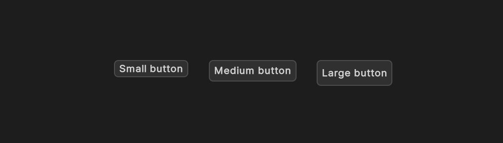
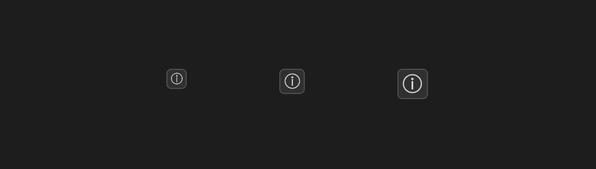
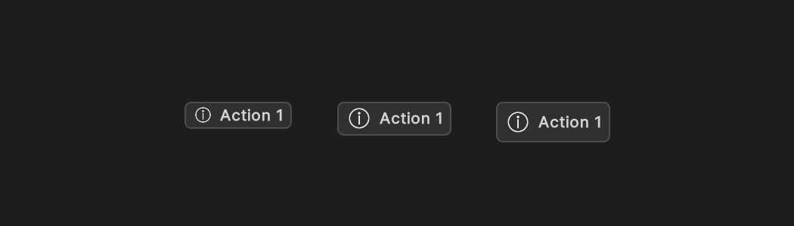
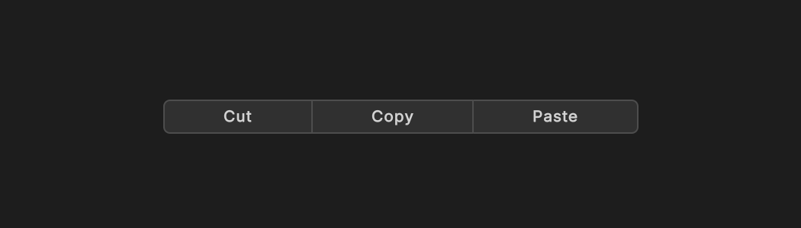
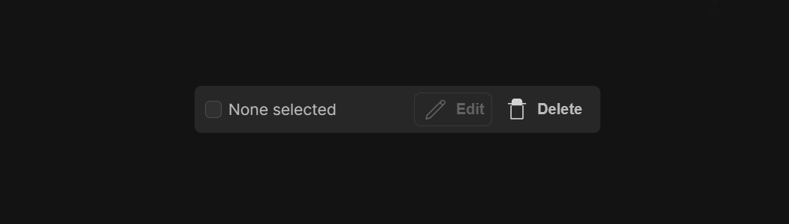

# Actions

Actions are the primary UI elements for triggering actions in your application.
App UI provides several pre-built components for these types of interactions, each with its own set of features and use cases.

## Handling events from Action components

An Action component can be triggered from multiple sources, such as a mouse click, a keyboard shortcut, or even a voice command.
In order to handle the trigger of the Action as a single event, we use a special manipulator called [`Pressable`](xref:Unity.AppUI.UI.Pressable).

This manipulator can be usually accessed on these components via a `clickable` property.

This example shows how to handle the trigger of a button from any source:

```csharp
using Unity.AppUI.UI;

var button = new Button();

// ❌ Wrong way to handle the trigger of the button, as it can be triggered from multiple sources
button.RegisterCallback<ClickEvent>(evt => Debug.Log("Button clicked"));

// ✅ Correct way to handle the trigger of the button from any source
button.clickable.clicked += () => Debug.Log("Button clicked");

// You could also use the special constructor if available
var otherButton = new Button(() => Debug.Log("Button clicked"));
```

## Available Components

> [!NOTE]
> The following components are following the **App UI Design** guidelines.

Here are some of the main Action components available in App UI.
To determine all the available properties for each component, see the [API Reference](xref:Unity.AppUI.UI).

### Button

The [Button](xref:Unity.AppUI.UI.Button) component is used to trigger an action or event, such as submitting a form,
opening a dialog, canceling an action, or performing a delete operation.

<p align="center">
  
</p>

```xml
<appui:Button title="Button" />
```

### IconButton

The [IconButton](xref:Unity.AppUI.UI.IconButton) component is used to trigger an action or event, such as submitting a form,
opening a dialog, canceling an action, or performing a delete operation. It is a variant of the [Button](#button) component that uses an icon instead of text.

<p align="center">
  
</p>

```xml
<appui:IconButton icon="add" />
```

### ActionButton

The [ActionButton](xref:Unity.AppUI.UI.ActionButton) component is a button that can have a "selected" state, and can be used as a toggle.
It can have text, an icon, or both, and can be customized with different themes and styles.

<p align="center">
  
</p>

```xml
<appui:ActionButton icon="add" label="Add" />
```

### ActionGroup

The [ActionGroup](xref:Unity.AppUI.UI.ActionGroup) component is a group of
[ActionButton](#actionbutton) components that can be used to toggle between different actions.

<p align="center">
  
</p>

```xml
<appui:ActionGroup>
    <appui:ActionButton icon="add" label="Add" />
    <appui:ActionButton icon="remove" label="Remove" />
</appui:ActionGroup>
```

### ActionBar

The [ActionBar](xref:Unity.AppUI.UI.ActionBar) component is a bar that appears when one or more items from a container are selected,
in order to apply some actions on them. It can contain [ActionButton](#actionbutton) components or other types of UI components.

<p align="center">
  
</p>

```xml
<appui:ActionBar>
    <appui:ActionButton icon="add" label="Add" />
    <appui:ActionButton icon="remove" label="Remove" />
</appui:ActionBar>
```
