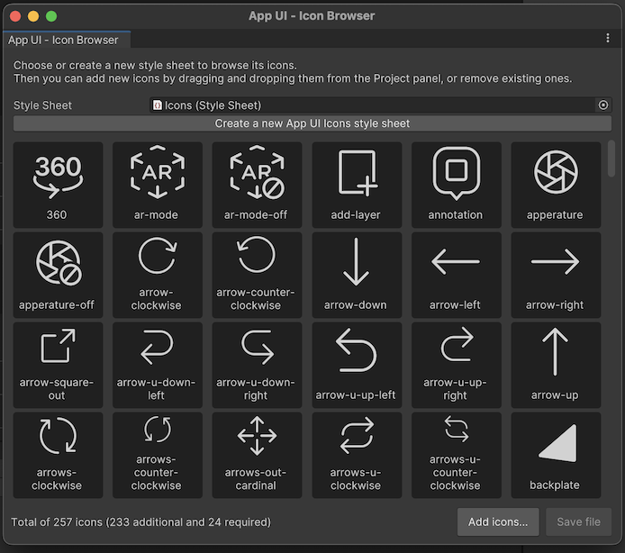

# Custom Icons

Every icon provided by App UI is available as a PNG file.
They are all referenced inside USS files, which are used to load the icons.

## Adding Custom Icons

To add a custom icon, you need to add a PNG file to your project and reference it in a USS file.

The naming convention used for the USS class name is `appui-icon--<name>--<variant in lowercase>`.

The variant by default is `Regular`, but you can use the following variants:

- `Regular`
- `Bold`
- `Light`
- `DuoTone`
- `Thin`
- `Fill`

Here's an example of how to add a custom icon named `home` with the `Regular` variant:

```css
.appui-icon--home--regular {
    --unity-image: url("path/to/home.png");
}
```

> [!IMPORTANT]
> Your USS class name must start with `appui-icon--` followed by the name of your icon
> in order to work with the [Icon](xref:Unity.AppUI.UI.Icon) UI component.

Then you can use the `Icon` UI component to display the icon:

```xml
<appui:Icon name="home" variant="Regular" />
```

## High DPI icons

To support high DPI icons, you need to add the high DPI icon with a `@2x` suffix to the name next to the original icon (in the same folder).

For example, if you have a `home.png` icon, you need to add a `home@2x.png` icon to the same folder.

Then when referring to the icon in your USS file, you need to use the `resource()` function instead of `url()`,
because the `resource()` function will track assets that are part of **Resources** folder. So implicitly the high DPI icon will part of your Runtime build.

Example:

```css
.appui-icon--home--regular {
    --unity-image: resource("MyIcons/home"); /* This will load the high DPI icon on devices with a pixel ratio of 2.0 */
    /* Note that "MyIcons" is a folder contained inside a Resources folder */
}
```

For more information about this feature, please refer to [UI-Toolkit documentation](xref:UIE-USS-PropertyTypes).

## Icon Browser

The **Icon Browser** is an Editor tool that allows you to generate the USS classes
for your custom icons.

To open the **Icon Browser**, go to `Window > App UI > Icon Browser`.

<p align="center">
  
</p>

To use this tool you need to work on an existing USS file asset that includes only icons.
If you don't have one, you can create a new one by right-clicking in the Project window
and selecting `Create > App UI > Icon Stylesheet`.
You can also directly click on `Create a new App UI Icons style sheet`
button in the **Icon Browser** window.

Make sure the stylesheet (USS) asset is set in the **Icon Browser** window.

To include new Icons in this stylesheet, you can:
- Drag and drop texture assets from the Project window to the **Icon Browser** window.
- Click on the `Add Icons...` button in the **Icon Browser** window and select the texture asset.

> [!NOTE]
> When adding already existing texture assets as Icons via the **Icon Browser**,
> the tool expects that the **name of the folder containing the texture** asset is
> the **name of the icon's variant**.
> For example, if you have a texture asset named `home.png` in a folder named `Regular`,
> the tool will generate the USS class `appui-icon--home--regular`.

> [!NOTE]
> App UI provides a set of icons that you can use in your project.
> You can find them in the `Packages/com.unity.dt.app-ui/PackageResources/Icons` folder.