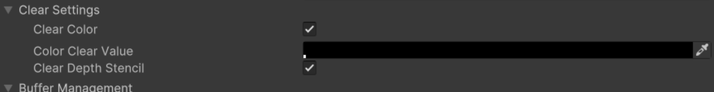
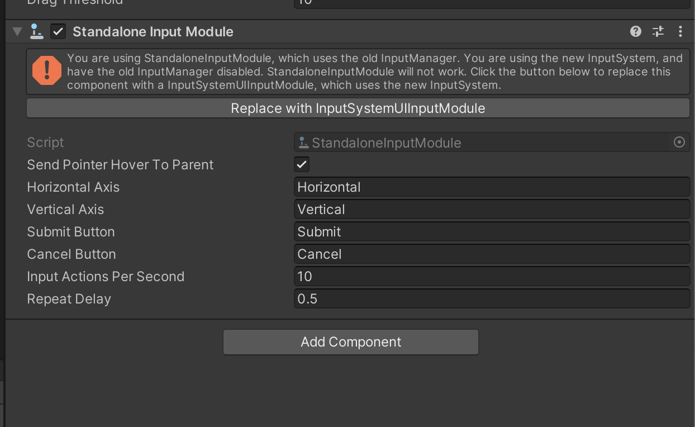
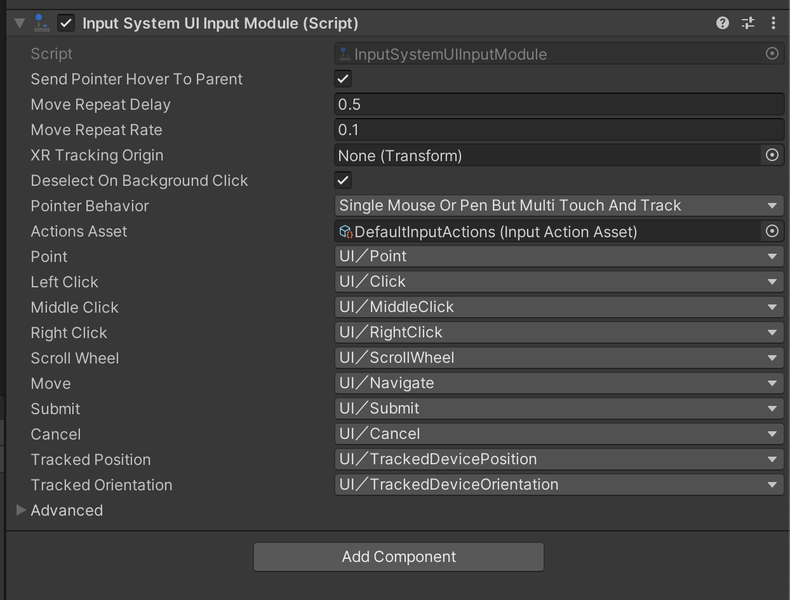

# Frequently Asked Questions

### Why can't I see the App UI components in the UI Builder components library?

By default, the UI Builder components library only shows the components that are available outside of
the `UnityEngine.*` and `Unity.*` namespaces. If you want to see the App UI components, you need to enable
the **Developer Mode** of the Unity Editor.

> [!NOTE]
> App UI components are officially available in the UI Builder components library starting from Unity 2021.3.36f1, 2022.3.19f1, 2023.2.9f1 and 2023.3.0b5.

To enable the **Developer Mode** of the Unity Editor, open the **About Unity** window and
while focusing on the **About Unity** window, type `internal` on your keyboard. This will
prompt you to restart the Unity Editor. After restarting the Unity Editor, you will be able to
see the App UI components in the UI Builder components library.

### In UI Builder, why App UI components look unstyled/broken?

The UI Builder use a default theme to display the visual tree inside the Preview panel.
This theme is useful for Editor windows development but it doesn't match the App UI theme.

To use the App UI theme in the UI Builder, choose the **App UI** theme in the **Theme** dropdown,
or a more specific theme like **App UI Dark - Medium** or **App UI Editor Dark - Small**.

### Does App UI support EditorWindow (Edit Mode)?

Yes, App UI supports EditorWindow. You can use App UI components in your Editor windows.

To make it work correctly, do not forget to load the right theme inside you window.

```cs
class MyWindow : EditorWindow
{
    void CreateGUI()
    {
        const string defaultTheme = "Packages/com.unity.dt.app-ui/PackageResources/Styles/Themes/App UI.tss";
        rootVisualElement.styleSheets.Add(AssetDatabase.LoadAssetAtPath<ThemeStyleSheet>(defaultTheme));
        rootVisualElement.AddToClassList("unity-editor"); // Enable Editor related styles
    }
}
```

You can also specify the theme stylesheet inside you UXML file directly.

```xml
<Style src="project:/Packages/com.unity.dt.app-ui/PackageResources/Styles/Themes/App UI.tss"/>
```

### My user-interface presented in a `WorldsSpaceUIDocument` is not refreshed correctly in my Unity scene.

When using a `WorldSpaceUIDocument` component, the referenced `PanelSettings` in `UIDocument` component of the same
game object is used to render the UI in the scene view. This `PanelSettings` must be configured to clear any information
about the previous rendering to avoid any artifacts.
Please make sure that the `PanelSettings` component is configured as follows:

- **Clear Color**: true
- **Clear Depth Stencil**: true

<p align="center">
  
</p>

In order to clear correctly the depth and stencil buffers, make sure the `RenderTexture` used by the `WorldSpaceUIDocument` is configured to support theses buffers.

We recommend a **Depth Stencil Format** set to `D32_SFLOAT_S8_UINT` or something equivalent for your target platform.

### I see an error message "Exception: Attempting to use an invalid operation handle" when I go in Play Mode

This error message is caused by an invalid load of Addressables content.
App UI uses Addressables via the Localization Unity Package only for the localization of text elements.
To avoid this message, you have 2 options:
- Go to **Edit > Project Settings > Localization** and check the **Initialize Synchronously** option.
- Upgrade the Localization package version used by your project (1.4.3 for example seems to have this issue fixed).

### Is the New Input System supported?

Yes, the New Input System is supported. You can use the App UI components with the New Input System.

To install the New Input System, go to **Window > Package Manager** and install the **Input System** package.

#### For Unity 2023.2 and newer

From **Unity 2023.2.x** and newer, the Input System and UI Toolkit are fully integrated. To configure UI Input you can
configure the UI action map of project-wide actions in **[Project Settings > Input System Package > Input Actions](https://docs.unity3d.com/Packages/com.unity.inputsystem@1.8/manual/Workflow-Actions.html)**.

#### For older versions of Unity

For older versions, the integration between the Input System and the UI system is handled by the [InputSystemUIInputModule](https://docs.unity3d.com/Packages/com.unity.inputsystem@1.7/api/UnityEngine.InputSystem.UI.InputSystemUIInputModule.html) component.

- In your scene, you will need to add the **Input System UI Module** component to your Event System.
  You can create a new Event System by going to **GameObject > UI > Event System**.
- You should see a message in the Inspector view asking you to update the Event System.
  Click on the **Replace with InputSystemUIInputModule** button.
  
- You can now use the App UI components with the New Input System.
  

For more information about UI Toolkit support for the New Input System, see their
[documentation](https://docs.unity3d.com/Packages/com.unity.inputsystem@1.8/manual/UISupport.html#ui-toolkit-support) page.

### Why does the Editor maximize docked windows when I try to zoom into an App UI [Canvas](xref:Unity.AppUI.UI.Canvas) component using an Apple trackpad?

This is a known issue with the Unity Editor on macOS.
To avoid this issue temporarily, you can disable the **Zoom gesture** in the **Trackpad** settings of your Mac. By
disabling the gesture, you will still be able to zoom in and out in the Canvas component, but the Editor will not
handle them anymore.

### I got a message "AppUINativePlugin.bundle is damaged and can't be opened" when I try to run my project on macOS, what should I do?

It is possible that the native plugins used by App UI are not correctly signed for the current macOS version you are using.
To fix this issue, you can try to upgrade the App UI package if possible, or you can use the `xattr` command to remove
the quarantine attribute from the `AppUINativePlugin.bundle` file.

```sh
xattr -d com.apple.quarantine <path-to-AppUINativePlugin.bundle>
```

Example when you are using App UI version 1.0.3:

```sh
xattr -d com.apple.quarantine <project-path>/Library/PackageCache/com.unity.dt.app-ui@1.0.3/Runtime/Core/Platform/macOS/Plugins/AppUINativePlugin.bundle
```

> [!WARNING]
> Be careful when using the `xattr` command, as it can remove the quarantine attribute from any file.
> Keep in mind that removing the quarantine attribute from a file can be a security risk, and the
> attribute will be removed only for your machine. This is proposed as a workaround and until
> the issue is fixed in the App UI package in next releases.

### I got a message "DllNotFoundException: AppUINativePlugin assembly" when I try to run my project on macOS, what should I do?

This error message is caused by the `AppUINativePlugin.bundle` file not being correctly loaded by the Unity Editor.
Follow the steps in the previous question to fix this issue.
