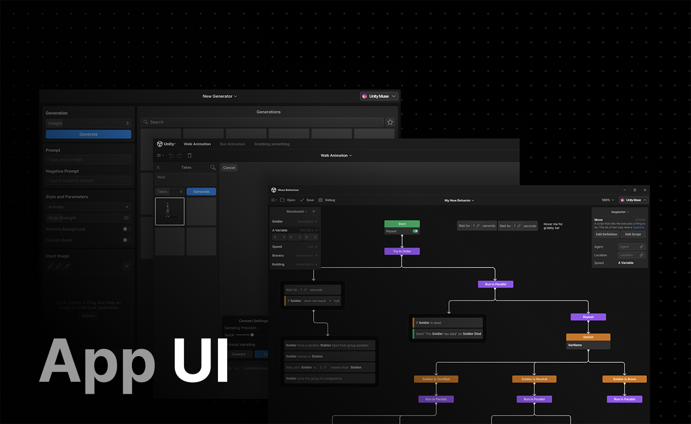

# App UI

 

> [!WARNING]
> App UI is considered as an experimental product. It is provided **"as is"** without warranty of any kind, express or implied.

## Introduction

App UI is a powerful and flexible framework for building beautiful, high-performance user interfaces in Unity.
The App UI framework is designed to help you create great apps with ease, by providing a set of UI components and patterns that
you can use to quickly build and customize your app's interface.

With App UI, you can build apps for a wide range of platforms, including Android, iOS, Windows, MacOS, and the web.
The framework is built on top of the Unity UI-Toolkit, which provides a powerful and flexible foundation for building UI elements that
work seamlessly across all platforms.

Whether you're an experienced developer or just getting started with Unity, App UI has everything you need to create amazing user interfaces for your apps.
From simple buttons and text boxes to more complex patterns like state management and navigation, the framework provides
a comprehensive set of tools and best practices to help you build great UIs in no time.

In this documentation, you'll learn how to get started with the App UI package, including how to set up a new project,
how to use the various UI components and patterns, and how to customize your app's interface to meet your specific needs.
You'll also find tips and best practices for working with the framework, as well as sample code and projects that demonstrate how to use the various features and patterns.

We hope that you find App UI to be a powerful and valuable tool for building great user interfaces in Unity.

Let's get started!

## Overview of the App UI

The App UI package is a collection of UI components and patterns that can be used to build a user interface for your Unity project.
But it also comes with a set of useful resources and tools.

### Components

Every UI component in the App UI package is defined as a [VisualElement](xref:UnityEngine.UIElements.VisualElement) in
[UI Toolkit](xref:UIElements). You can find them in the `Unity.AppUI.UI` namespace.

### Features

The App UI package also provides a set of UI patterns that you can use to build more complex UIs.
* [Architecture](xref:mvvm-intro): Build your app using the MVVM architecture.
* [Observables](xref:mvvm-observable): Bind your UI to data using observables.
* [Dependency Injection](xref:mvvm-di): Inject dependencies into your UI components and other objects.
* [Context Management](xref:contexts): Feed your UI with data from a global or scoped context.
* [Navigation](xref:navigation): Navigate between different screens in your app (useful for mobile apps).
* [Overlays](xref:overlays): Display UI elements on top of your app's content.
* [Localization](xref:localization): Localize your app's interface.
* [Accessibility](xref:accessibility): Make your app more inclusive.
* [Native Integration](xref:native-integration) (Android, iOS, MacOS, Windows)

### Resources

The App UI package comes with a set of useful resources that you can use to build your app's interface.
These resources include:
* [Icons](xref:iconography)
* [Fonts](xref:typography)
* [Themes](xref:theming)

### Tools and Samples

The package contains several tools and samples that you can use to build your app's interface.
* [UI Kit](xref:ui-kit): A sample project that demonstrates how to use the App UI components and patterns.
* [Storybook](xref:storybook): A tool that allows you to browse and test App UI or custom components and patterns.
* [Navigation](xref:navigation-sample): A sample project that demonstrates how to use the navigation pattern.
* [MVVM](xref:mvvm-sample): A sample project that demonstrates how to use the MVVM architecture.
* [Redux](xref:redux-sample): A sample project that demonstrates how to use the Redux architecture.
* [MVVM and Redux](xref:mvvm-redux-sample): A sample project that demonstrates how to use the MVVM and Redux architectures together.
* [Undo/Redo](xref:undo-redo-sample): A sample project that demonstrates how to use the undo/redo pattern.

## Helpful Links

* [UI Toolkit Documentation](xref:UIElements)
