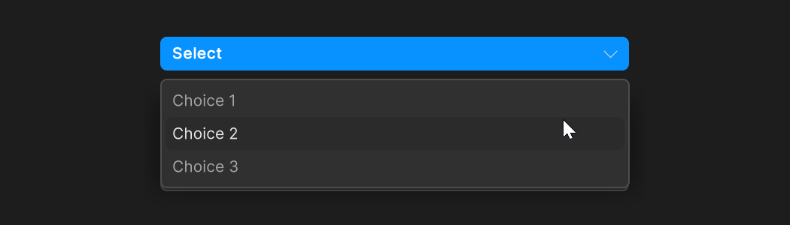
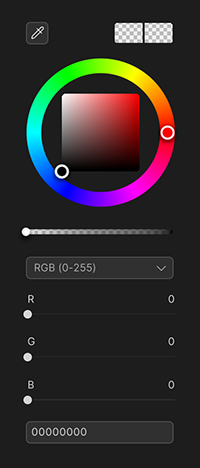
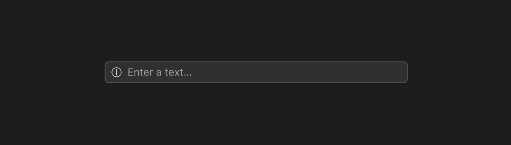
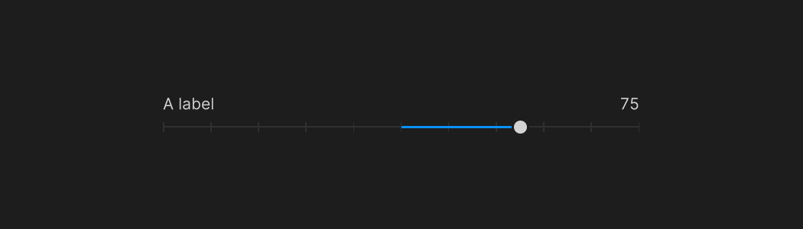
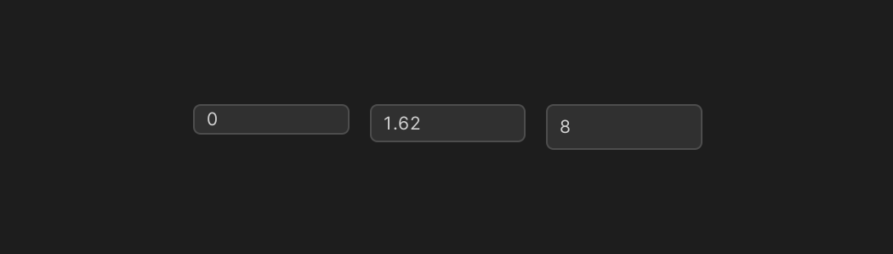
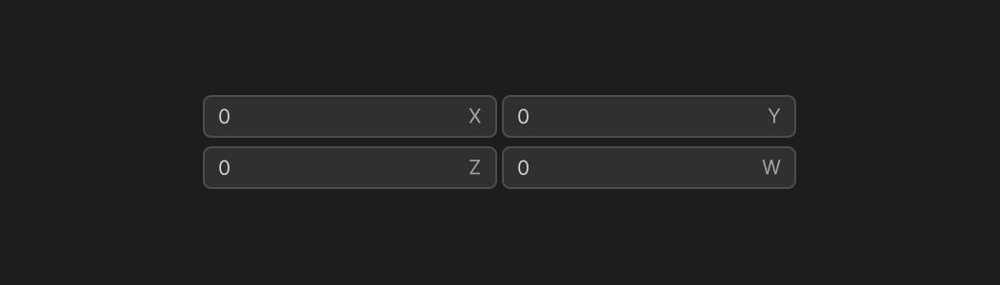
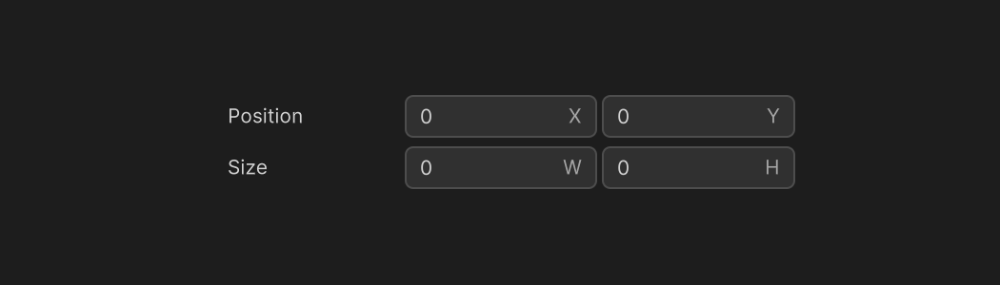
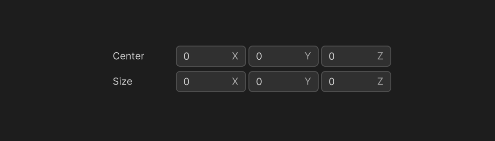
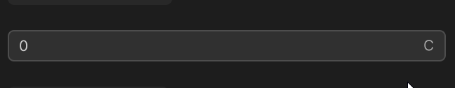

# Inputs

Inputs components are used to get input from the user through UI controls.
App UI provides a wide range of Input components that can be easily integrated into your Unity projects.

## Input Label

The [InputLabel](xref:Unity.AppUI.UI.InputLabel) element is used to display a name next to an input control.
The InputLabel element can be used with any input control and will decorate it with a label, required indicator and helper text.

```cs
// This code creates a Name field with a label.
// The field is valid if it contains at least 1 character.
var myField = new TextField();
var label = new InputLabel("Name");
label.inputAlignment = Align.Stretch;
label.labelOverflow = TextOverflow.Ellipsis;
label.indicatorType = IndicatorType.Asterisk;
label.required = true;
label.helpVariant = HelpTextVariant.Destructive;
myField.validateValue = val => !string.IsNullOrEmpty(val);
myField.RegisterValueChangedCallback(evt =>
{
    label.helpMessage = myField.invalid ? "Name is required" : null;
});
```

## Boolean Inputs

Boolean inputs are used to get a boolean value from the user, typically through a checkbox or a toggle.

<p align="center">
  
</p>

In App UI, you can use the [Checkbox](xref:Unity.AppUI.UI.Checkbox) element to create a checkbox,
and the [Toggle](xref:Unity.AppUI.UI.Toggle) element to create a toggle.

## Selection Inputs

Selection inputs are used to get a value from a list of pre-defined values.

<p align="center">
  
</p>

In App UI, you can use the [Dropdown](xref:Unity.AppUI.UI.Dropdown) element to create a dropdown list,
and the [RadioGroup](xref:Unity.AppUI.UI.RadioGroup) element to create a radio button group.

## Color Inputs

Color inputs are used for selecting colors.

<p align="center">
  
</p>


## Text Inputs

Text inputs are used for entering text values.

<p align="center">
  
</p>

In App UI, you can use the [TextField](xref:Unity.AppUI.UI.TextField) element to create a text field,
and the [TextArea](xref:Unity.AppUI.UI.TextArea) element to create a text area.

## Numeric Inputs

Although there are multiple data structure that implies numerical values.
Also, the precision of the value can vary from one data structure to another.
We aim to provide different version of our component in order to fit the needs of the user.

### Sliders

Slider inputs are used for selecting a value from a range of values.

<p align="center">
  
</p>

In App UI, you can use the [SliderFloat](xref:Unity.AppUI.UI.SliderFloat) element to create a slider.
You can also use the [SliderInt](xref:Unity.AppUI.UI.SliderInt) element to create a slider with integer values.
For touch devices, you can use the [TouchSliderFloat](xref:Unity.AppUI.UI.TouchSliderFloat) element to create a slider.
You can also use the [TouchSliderInt](xref:Unity.AppUI.UI.TouchSliderInt) element to create a slider with integer values.

### Numerical Fields

Numeric inputs are used for entering numerical values.

<p align="center">
  
</p>

### Vectors

<p align="center">
  
</p>

### Rects and Bounds

<p align="center">
  
</p>

<p align="center">
  
</p>

### Expression Evaluation

<p align="center">
  
</p>

