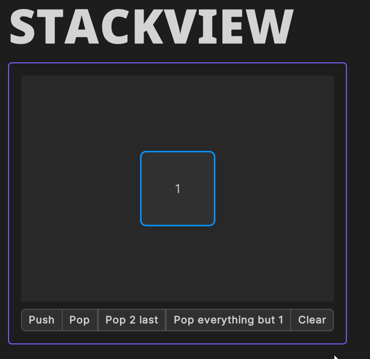
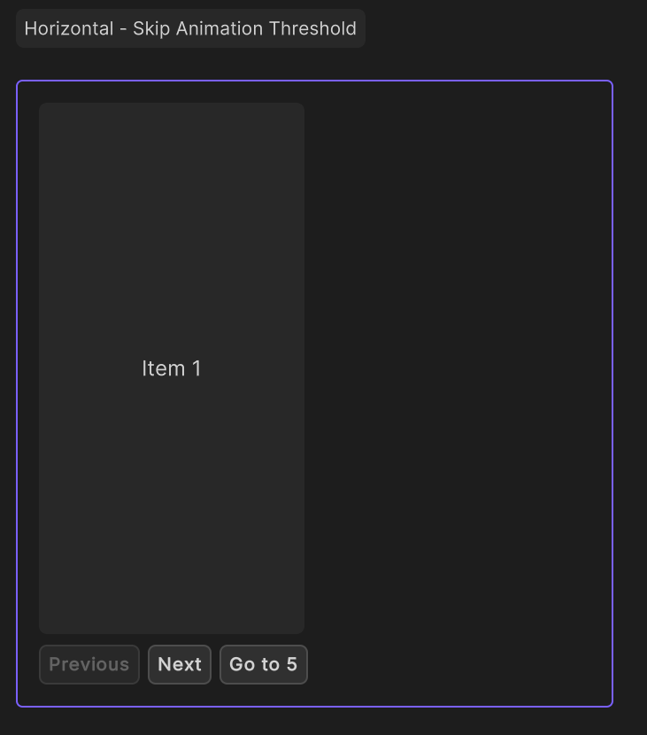

# Layouts

App UI provides a variety of layout components
to help you create the UI of your Unity project.

## Layout Components

### App UI Panel

The [App UI Panel](xref:Unity.AppUI.UI.Panel) component is
the root component of the App UI system. At the layout level, it provides a layering system to handle popups, notifications, and tooltips. They will be displayed as overlays in the same [UIDocument](xref:UnityEngine.UIElements.UIDocument).

### Containers

Containers are layout components that contain several similar child elements.
They are used to group elements together and to apply a layout to them.

#### StackView

The [StackView](xref:Unity.AppUI.UI.StackView) component is
a container that arranges its children one over the other,
in a Z-axis stack. You can push and pop elements from the stack at runtime,
and you can also animate the transition between the elements.

  

#### SwipeView

The [SwipeView](xref:Unity.AppUI.UI.SwipeView) component is
a container that arranges its children in a horizontal or vertical stack,
and allows the user to swipe between them.
This view can display more than one child at a time,
and it can also be used to create a *carousel* effect by using the wrap mode.

  

  

#### PageView

The [PageView](xref:Unity.AppUI.UI.PageView) component is
a the composition of a [SwipeView](xref:Unity.AppUI.UI.SwipeView) and a
[PageIndicator](xref:Unity.AppUI.UI.PageIndicator) components.
It allows the user to swipe between pages, and to see the current page index.

### Dialogs

Dialogs are layout components that are used to display a message to the user.

#### Dialog

The [Dialog](xref:Unity.AppUI.UI.Dialog) component is
a layout component composed of a heading, a body, and a footer.

#### Alert

The [AlertDialog](xref:Unity.AppUI.UI.AlertDialog) component is
similar to the [Dialog](xref:Unity.AppUI.UI.Dialog) component,
but its styling will depend on its [AlertSemantic](xref:Unity.AppUI.UI.AlertSemantic) property.

### Others Views

#### SplitView

The [SplitView](xref:Unity.AppUI.UI.SplitView) component is
a layout component that allows the user to resize its children.

#### VisualElement & ScrollView

The [VisualElement](xref:UnityEngine.UIElements.VisualElement) and
[ScrollView](xref:UnityEngine.UIElements.ScrollView) components are
layout components that are part of the [UI Toolkit](xref:UIElements) system.
When you didn't find a layout component that fits your needs,
you can use these components to create your own layout.