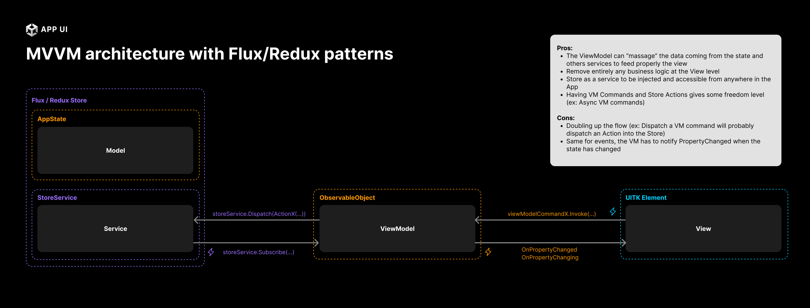

# Introduction to the MVVM Pattern

The **MVVM** pattern is a design pattern that helps to separate the user interface from the business logic.
It is a common pattern used in many applications, and have been popularized by
the [WPF](https://docs.microsoft.com/en-us/dotnet/desktop/wpf/overview/?view=netframeworkdesktop-4.8) framework.

The way to architecture a project with [UI Toolkit](xref:UIElements) can become very similar to what is done with WPF.
You usually end up with a markup file that contains the UI elements, and a code-behind file that contains the business logic.
Both parts work together as a View.

## Model

The **Model** is a simple Data Structure that contains the data that is used by your business logic.

## ViewModel

The **ViewModel** is the class that contains the business logic.
It is responsible for updating the Model when the user interacts with the View.
It also contains the logic to update the View when the Model changes.

The ViewModel and the View are connected via Data Binding features.

## View

The **View** is the part of the application that is responsible for displaying the data to the user.
It is usually composed of UI elements. The view should not contain any business logic. The logic contained in the View should be
related to the styling of the UI elements for example.

# Using MVVM with state management

App UI implements a Redux-like state management system that can be used with the MVVM pattern.

 

For more information about the state management system, see [State Management](xref:state-management).

# Additional Resources

For more information about the MVVM pattern, you can check the following resources:
* [MVVM Pattern](https://en.wikipedia.org/wiki/Model%E2%80%93view%E2%80%93viewmodel)
* [MVVM Pattern in WPF](https://learn.microsoft.com/en-us/dotnet/desktop/wpf/introduction-to-wpf?view=netframeworkdesktop-4.8)
