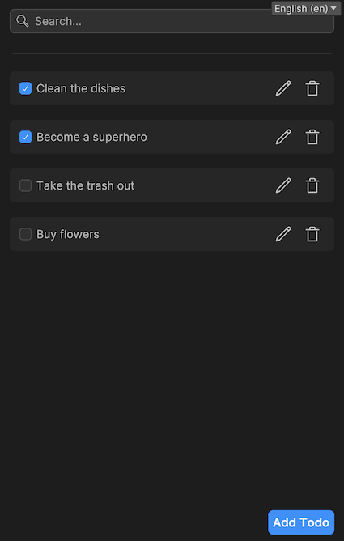

# MVVM & Redux Sample

The MVVM & Redux Sample shows how to adopt a MVVM architecture but also Redux-like state management with the App UI Unity package.
If you are not familiar with MVVM or Redux, we suggest you to read the [MVVM](xref:mvvm-intro) and the
[State management](xref:state-management) documentations.

> [!NOTE]
> This sample is quite advanced in terms of architecture. If you are looking for a simpler MVVM sample,
> you can check the [MVVM Sample](xref:mvvm-sample) section.

## Getting Started

### Installation

To use the MVVM & Redux sample, you will need to have this package installed in your project.

To install the package, follow the instructions in the [Installation and Setup](xref:setup)
section of the documentation.

Inside the Unity Package Manager window, select the **App UI** package, then
go to **Samples** and select **MVVM And Redux**. Click **Install** to install the sample.

### Usage

To open the sample, in your Project panel go to
**Assets > Samples > App UI > MVVM And Redux > Scenes** and open the **MVVMRedux** scene.

This scene contains the prototype of a Todo app. You can add, remove, rename and toggle the completion of a Todo. There
is also a search bar to filter the Todo list.

Go in Play mode and give it a try!

  

