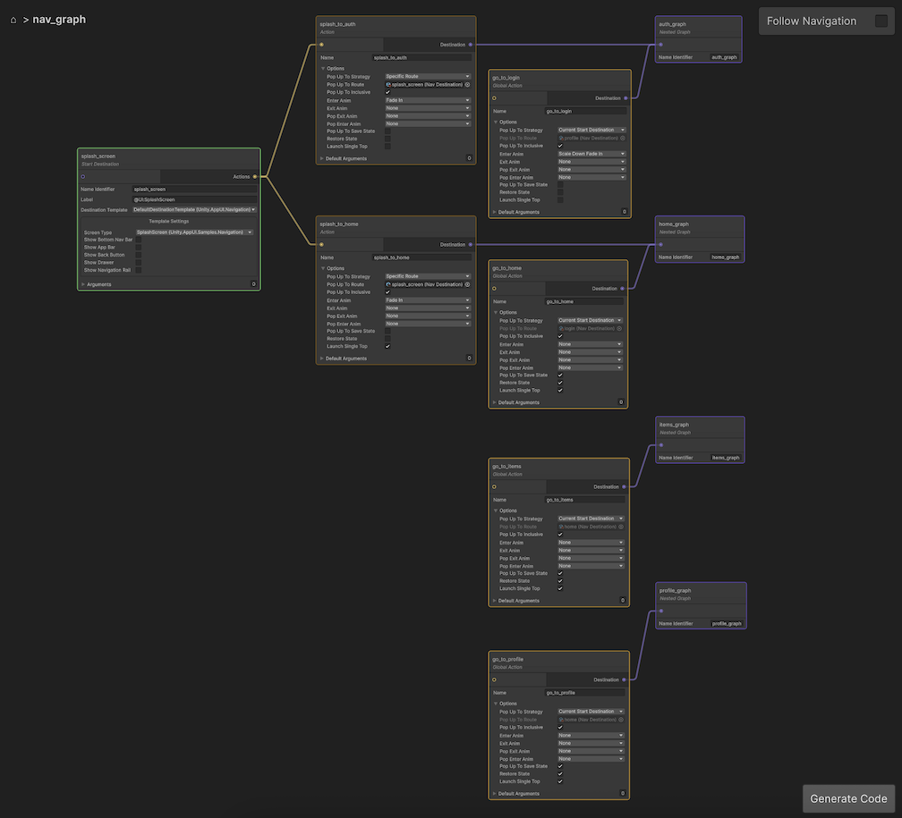

# Navigation Sample

The App UI package includes a sample to demonstrate the [navigation](xref:navigation) system.

## Getting Started

### Installation

To use the Navigation sample, you will need to have this package installed in your project.

To install the package, follow the instructions in the [Installation and Setup](xref:setup)
section of the documentation.

Inside the Unity Package Manager window, select the **App UI** package, then
go to **Samples** and select **Navigation**. Click **Install** to install the sample.

### Usage

To open the sample, in your Project panel go to
**Assets > Samples > App UI > Navigation > Scenes**. Then open the **NavigationSample** scene.

The scene contains an empty [UIDocument](xref:UnityEngine.UIElements.UIDocument) which will be populated
with the Navigation UI elements at runtime.

Before going to Play Mode, we suggest to open the Navigation graph that is used by this sample. it will give you
the opportunity to familiarize yourself with the graph and the different nodes.

To open the graph, just double-click on the **NavigationSample** asset located in
the **Assets > Samples > App UI > Navigation > Resources > Navigation** folder.

You should see the following graph:

  

> [!NOTE]
> If you want more information about the Navigation graph, see the [Navigation](xref:navigation) documentation.

Now, you can enable **Follow Navigation** in
the **Navigation Graph** window to see the navigation in
action while in Play Mode!