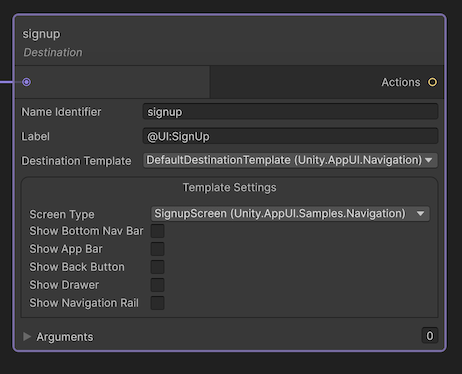
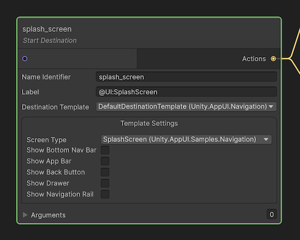
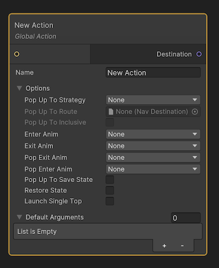
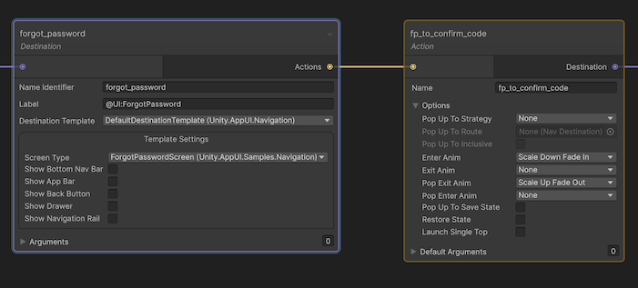
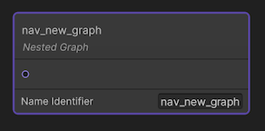

# Navigation

App UI provides a navigation system that can be used to navigate between pages in your application.
This is useful to define specific flows in your application and to provide a better user experience.

## Navigation Destination

A navigation destination is a page that can be navigated to. A navigation destination is defined by a [NavDestination](xref:Unity.AppUI.Navigation.NavDestination) component.

To reach a navigation destination, you need to link some navigation actions to it.

## Navigation Action

A navigation action is a component that can be used to navigate to a navigation destination. A navigation action is defined by a [NavAction](xref:Unity.AppUI.Navigation.NavAction) component.

Inside the navigation action, you can define the way the navigation is performed, such as an animation or a transition, or the way the back stack is managed.

A Navigation action can be Local or Global. A local navigation action can be used to perform a navigation from a specific previous navigation destination.
A global navigation action can be used to perform a navigation from any navigation destination in the navigation graph.

With nested navigation graphs, you can use global navigation actions to navigate between navigation graphs.

## Navigation Graph

A navigation graph is a set of pages that can be navigated to. A navigation graph is defined by a [NavGraph](xref:Unity.AppUI.Navigation.NavGraph) component.
When building an application which contains separate flows, it is recommended to create a separate navigation graph for each flow.

The navigation graph must always have a start destination. The start destination is the first page that will be displayed when navigating to the navigation graph.

For example, if you have a login flow and a main flow, you can create two navigation graphs, one for the login flow and one for the main flow.

You can nest navigation graphs to create more complex navigation flows. For example, if you have a main flow that contains a settings flow, you can create a navigation graph for the main flow and a navigation graph for the settings flow.

## Navigation Graph View

A navigation graph view is the main Unity asset that contains one several nested navigation graphs. A navigation graph view is defined by a [NavGraphViewAsset](xref:Unity.AppUI.Navigation.NavGraphViewAsset) component.

This is the main resource used by the navigation host to display the pages in the navigation graph.

## Navigation Host

A navigation host is a component that can host a navigation graph. A navigation host is defined by a [NavHost](xref:Unity.AppUI.Navigation.NavHost) component.

A navigation host can host a single navigation graph view asset. When navigating to a page, the navigation host will display the page in the navigation host,
including the navigation components which can be controlled via the [INavVisualController](xref:Unity.AppUI.Navigation.INavVisualController) interface.

## Navigation Controller

A navigation controller is a component that can be used to navigate between pages in a navigation graph. A navigation controller is defined by a [NavController](xref:Unity.AppUI.Navigation.NavController) component.

A navigation controller can be used to navigate to a page in a navigation graph. When navigating to a page, the navigation controller will handle the
navigation back stack and will request the navigation host to display a new page.

A navigation controller is always attached to a single navigation host. It is created automatically when a navigation host is instantiated.

## Navigation Visual Components

### Handling Visual Components Globally : Navigation Visual Controller

A navigation visual controller is a component that can be used to control the content of the navigation components. A navigation visual controller is defined by a [INavVisualController](xref:Unity.AppUI.Navigation.INavVisualController) interface.

You can implement this interface to control the content of the navigation components.

For example, you can use this interface to display the title of the page in the AppBar component, or to display a list of links to other pages in the Drawer component.

Here is an example of a custom navigation visual controller:

```cs
class MyVisualController : INavVisualController
{
    public void SetupBottomNavBar(BottomNavBar bottomNavBar, NavDestination destination, NavController navController)
    {
        if (!destination.showBottomNavBar)
            return;

        var homeButton = new BottomNavBarItem("info", "Home", () => navController.Navigate(Actions.navigateToHome))
        {
            isSelected = destination.name == Screens.home
        };
        bottomNavBar.Add(homeButton);

        // etc ...
    }
    public void SetupAppBar(AppBar appBar, NavDestination destination, NavController navController)
    {
        if (!destination.showAppBar)
            return;

        appBar.title = destination.label;
    }
    public void SetupDrawer(Drawer drawer, NavDestination destination, NavController navController)
    {
        if (!destination.showDrawer)
            return;

        drawer.Add(new DrawerHeader());
        drawer.Add(new Divider { vertical = false });
        var homeButton = new MenuItem {icon = "info", label = "Home", selectable = true};
        homeButton.SetValueWithoutNotify(destination.name == Screens.home);
        homeButton.clickable.clicked += () => navController.Navigate(Actions.navigateToHome);
        drawer.Add(homeButton);

        // etc ...
    }
}
```

Then you can assign this controller to the navigation host:

```cs
var navHost = new NavHost();
navHost.visualController = new MyVisualController();
```

### Handling Navigation Visual Components Per Navigation Screen

You also have the possibility to implement
[SetupAppBar](xref:Unity.AppUI.Navigation.NavigationScreen.SetupAppBar(Unity.AppUI.UI.AppBar)),
[SetupBottomNavBar](xref:Unity.AppUI.Navigation.NavigationScreen.SetupBottomNavBar(Unity.AppUI.UI.BottomNavBar)) and
[SetupDrawer](xref:Unity.AppUI.Navigation.NavigationScreen.SetupDrawer(Unity.AppUI.UI.Drawer))
methods directly in your implementation of
[NavigationScreen](xref:Unity.AppUI.Navigation.NavigationScreen).

```cs
class MyAppHomeScreen : NavigationScreen
{
    public override void SetupAppBar(AppBar appBar, NavController navController)
    {
        appBar.title = "Home";
    }
}
```

## Components

App UI provides a set of navigation components that can be used to create a navigation menu for your application.

### AppBar Navigation Component

The [AppBar](xref:Unity.AppUI.UI.AppBar) component is a navigation component located at the top
of the screen. It can be used to display a button to display the [Drawer](#drawer-component) and a title.

You can also add a [actions](xref:Unity.AppUI.UI.ActionButton) to the AppBar component to display a button on the right side of the AppBar.

When navigating to a page, you can set the [title](xref:Unity.AppUI.UI.AppBar.title) property of the AppBar component to display the title of the page.
If the navigation back stack is not empty, the AppBar component will display a back button that will navigate to the previous page.

### Drawer Component

The [Drawer](xref:Unity.AppUI.UI.Drawer) component is a navigation component located on the left or right side of the screen.
It can be used to display a list of links to other pages in your application, or to display a list of links to other applications.

The Drawer component can be collapsed or expanded. When collapsed, the AppBar component will display a button to expand the Drawer component.
The Drawer component can be expanded by clicking on the button displayed by the AppBar component, or by dragging the edge of the screen.

### BottomNavBar Component

The [BottomNavBar](xref:Unity.AppUI.UI.BottomNavBar) component is a navigation component located at the bottom of the screen.

The BottomNavBar component can be used to display a list of links to other pages in your application, or to display a list of links to other applications.

## Navigation Graph Editor

The Navigation Graph Editor is a visual editor that can be used to create and edit navigation graphs.

<p align="center">
  
</p>

To create a new navigation graph asset, right click on the **Project** window and select **Create** > **App UI** > **Navigation Graph**.

To open the Navigation Graph Editor, double click on the navigation graph asset in your **Project** window.

### Nodes

#### Destination Node

A destination node represents a page in the navigation graph.
A destination node is defined by a [NavDestination](xref:Unity.AppUI.Navigation.NavDestination) component.
A destination node can be connected to other destination nodes using [actions](#action-node).

<p align="center">
  
</p>

When a Destination node is used as the start destination of the navigation graph, its node will be outlined in green.

<p align="center">
  
</p>

> [!NOTE]
> A navigation graph can have only one start destination. By default when a single destination node is present in the
> navigation graph, it will be used as the start destination.

#### Action Node

An action node represents a navigation action in the navigation graph.
An action node is defined by a [NavAction](xref:Unity.AppUI.Navigation.NavAction) component.

When navigating from a destination to another one, the navigation controller will execute the action associated with the
action node that links the two destination nodes.

By default, when creating a new Action Node, the action will be defined as a **Global Action**. That means
that the action will be available from any destination in the current navigation graph and nested ones.

<p align="center">
  
</p>

As soon as you link a destination on the action node's input port, the action will be defined as a **Local Action**.

<p align="center">
  
</p>

The output port of an action node can be connected to the input port of a destination node or a group node. At runtime,
the navigation controller will find the start destination of the navigation graph and will execute the action associated
with the action node that links the start destination to another destination.

#### Nested Graph Node

A nested graph node represents a nested navigation graph in the navigation graph.
A nested graph node is defined by a [NavGraph](xref:Unity.AppUI.Navigation.NavGraph) component.

<p align="center">
  
</p>

To browse a nested navigation graph, you can double click on the nested graph node.
This will open the nested navigation graph in place of the current navigation graph. You can go back to the parent
navigation graph by choosing **Go Back** option in the context menu of the navigation graph editor, or by clicking one of
the items in the breadcrumb bar.

### Code Generator

The Navigation Graph Editor can generate C# code that can be used in your application to navigate between pages.
While it is not required to use the generated code, it can be useful to avoid typos when navigating between pages.

The generated code follow this template:

```cs
namespace namespace Unity.AppUI.Navigation.Generated
{
    public partial static class Actions
    {
        public const string <actionName> = "<actionName>";
        [...]
    }

    public partial class Destinations
    {
        public const string <destinationName> = "<destinationName>";
        [...]
    }

    public partial class Graphs
    {
        public const string <graphName> = "<graphName>";
        [...]
    }
}
```

To generate the code, click on the **Generate Code** button in bottom-right corner of the navigation graph editor.
This will prompt you to select a folder where the code will be generated. The generated code will be named after the
navigation graph asset.