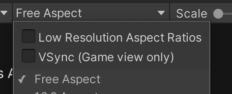
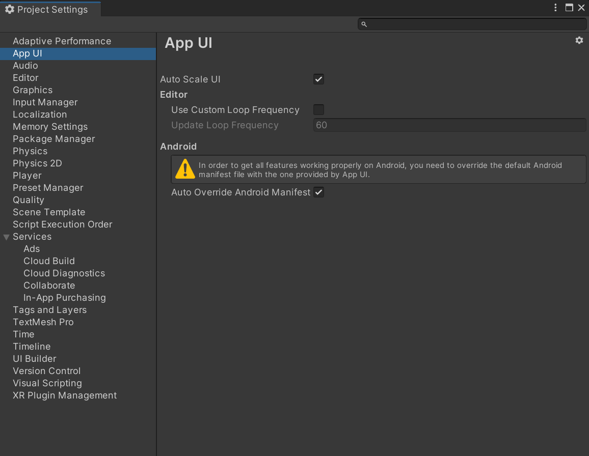

# Installation And Setup

## Download the Package

To use the App UI Unity Package, you will need to download it from the Unity Package Manager.

- Inside the Unity Editor, go to **Windows > Package Manager**
- Click the **+** button at the top left of the window
- Select **Add package from git URL...**
- Enter the following URL: `com.unity.dt.app-ui`
- Click the **Add** button

## Preliminary Setup

### High-DPI Screens

On certain version of the Editor, you might need to do some preliminary setup before using the App UI package.

On high DPI screens, such as Retina, the Game view inside the Unity Editor enables the support of low-resolution aspect ratios,
which can be problematic with the UI scaling system from App UI. Our system tends to scale the UI elements to match the current OS pixel density.

It is highly suggested to **disable** this feature. You can find it inside the **Aspect Ratio** dropdown.

  

### App UI Settings file

The App UI package comes with a settings file that you can use to configure the default values for the UI elements.
To generate this file, go to **Edit > Project Settings > App UI**.
If there's no settings file, you can generate one by clicking on the **Generate Settings File** button.

  

> [!NOTE]
> The settings file is generated inside the `Assets` folder.

> [!NOTE]
> There's no need to generate a settings file if you are not willing
> to change the default values.

> [!WARNING]
> If your project contains multiple settings files,
> you will need to choose the right one from the dropdown
> menu inside the **App UI** settings window.

Here are the available settings:

- #### Auto correct the UI scale

  This setting allows you to enable or disable the automatic UI scaling. When enabled, the UI elements will automatically scale to match the current OS pixel density.
  Like in web browser, our stylesheets are designed to work with a 96 DPI screen. When the screen has a higher DPI, the UI elements will be scaled up to match the current DPI.
  This way your CSS stylesheets will work as USS stylesheets in your Unity project.

- #### Editor-only mode

  This setting allows you to enable or disable the editor-only mode. When enabled, the App UI manager will inject
  a scripting definition symbol to the project settings which will prevent App UI assemblies to get included in the build.
  This setting is disabled by default and is only useful if you want to use App UI features only in the editor.

> [!NOTE]
> USS stands for **Unity Style Sheets**. It is the new UI styling system introduced with UI Toolkit.
>
> This stylesheet system is not a superset of CSS, which means that some CSS properties might not work as expected.
>
> Fore more information about USS, see the [official documentation](https://docs.unity3d.com/Manual/UIE-about-uss.html).

- #### Editor Update Frequency

  This setting allows you to configure the frequency App UI will do an update in the editor. The default value is `60`, which means that the UI will be updated sixty times per second.
  This is the recommended value for the editor, as it allows you to see the UI changes in an expected time for your future builds.

  If you want to simulate a slower device, you can set this value to `1` to update the UI only once per second.

  This setting is mainly used by the App UI internal message queue.

  > [!NOTE]
  > This Editor Update Frequency setting has an effect only in the Editor. In standalone builds, App UI uses the [`MonoBehaviour.Update()`](xref:UnityEngine.MonoBehaviour) event to do its updates.

- #### Override Android Main Manifest

  This setting allows you to override the Android main manifest file. Having a custom manifest file for Android development is useful
  if you want to add some custom permissions or features to your Android build. App UI gives the best experience when the some permissions are enabled,
  like [`VIBRATE`](https://developer.android.com/reference/android/Manifest.permission#VIBRATE) for haptic feedback support. It is encouraged to enable this setting if you want to use the App UI package on Android.
  This is why this setting is **enabled by default**.

  > [!NOTE]
  > This setting only affects [Android](https://docs.unity3d.com/Manual/android-introducing.html) development.
  >
  > On others platforms there is no need to override a manifest file.

- #### Include App UI Shaders In Player Build

  This setting allows you to include the App UI shaders in the player build.
  By default, this setting is enabled.
  If you are not using the App UI shaders, you can disable this setting to reduce the build size.

  > [!NOTE]
  > The App UI shaders are used to render the UI elements.
  > If you are using the App UI package, you will need to enable this setting.
