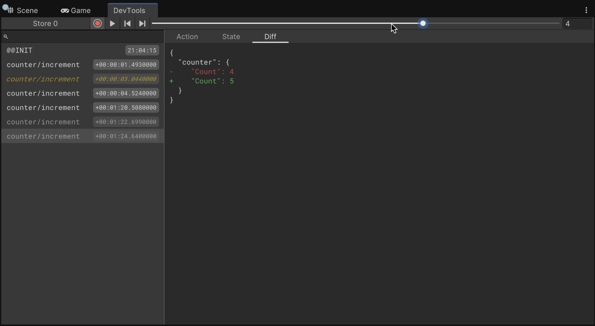

# State Management

App UI provides an additional assembly called `Unity.AppUI.Redux` that contains a set of classes that implement
the [Redux](https://redux.js.org/) pattern.

The Redux pattern is a way to manage the state of your application.
It is a pattern that is used in many different frameworks and libraries, especially in the JavaScript ecosystem.

The Redux pattern is based on the following principles:

* The state of your application is stored in a single object called the `store`.
* The only way to change the state is to dispatch an `action` to the `store`.
* To specify how the state tree is transformed by actions, you write pure `reducers`.
* The `store` is created by combining the `reducers` into a single reducer function.
* The `store` has a single `dispatch` method that accepts an `action` and returns a `state` object.
* The `store` has a single `getState` method that returns the current `state` object.
* The `store` has a single `subscribe` method that accepts a callback that is called every time the `state` changes.

For more extensibility, App UI includes the concept of **Slice**. A slice is a part of the state tree that is managed by a
specific reducer. A slice can be used to manage a specific part of the application state, such as the state of a specific
screen. It is also useful to monitor changes on a specific part of the state tree. This approach is similar to what
offers [Redux Toolkit](https://redux-toolkit.js.org/).

## Components

### Store

The [Store](xref:Unity.AppUI.Redux.Store`1) class is the main entry point for the Redux pattern.
It is responsible for creating the `store` and dispatching actions to it.

App UI offers a generic type [Store&lt;TStore&gt;](xref:Unity.AppUI.Redux.Store`1) to represent the store.

The [Store&lt;TStore&gt;](xref:Unity.AppUI.Redux.Store`1) class is a generic class that accepts the type of the state
object as a type parameter. The state object is a class that contains the current state of the application.
You can use directly the generic version of the `Store` class to support your very own type of state.

```cs
using Unity.AppUI.Redux;

record MyState {}

var store = Store.CreateStore<MyState>((state, action) => state, new MyState());
```

If you want to support slices in your state, we recommend to use our
[PartitionedState](xref:Unity.AppUI.Redux.PartitionedState) class as state type.

Example of creating a Store with slices:
```cs
using Unity.AppUI.Redux;

record MyState {}

var store = StoreFactory.CreateStore(new []
{
    StoreFactory.CreateSlice(
        "mySlice",
        new MyState(),
        builder => { /*  ... */ },
        ),
});
```

Example of using the `IPartionableState` interface:
```cs
using Unity.AppUI.Redux;

class MyState : IPartionableState<MyState>
{
    public TSliceState Get<TSliceState>(string sliceName)
    {
        // Implement the method to return the slice state.
    }

    public MyState Set<TSliceState>(string sliceName, TSliceState sliceState)
    {
        // Implement the method to set the slice state.
        // Remember that the state object is immutable, so the returned object should be a new instance.
    }
}
```

### Reducer

A reducer is a pure function that takes the current state and an action as parameters and returns the new state.
The user has to create Reducers as pure functions inside the application code. You can check the [Simple Counter](#simple-counter)
example to see how to create a reducer.

### Slice

A [Slice](xref:Unity.AppUI.Redux.Slice`2) is a part of the state tree that is managed by a specific reducer.
You can add multiple slices to the store. Each slice has a unique name that is used to identify it.

### Action Creator And Action

An [ActionCreator](xref:Unity.AppUI.Redux.IActionCreator) is the type used to create an action.

An [Action](xref:Unity.AppUI.Redux.IAction) is an object that is dispatched to the store. It can contain a type and a payload.

To get an action instance from the Actioncreator, you can call the
[Invoke](xref:Unity.AppUI.Redux.ActionCreator.Invoke) method on the action creator, and eventually
pass the action parameters to it (if any).

You can then dispatch the action to the store using the [Dispatch](xref:Unity.AppUI.Redux.IDispatchable.Dispatch(Unity.AppUI.Redux.Action)) method.

### Async Thunk

An async thunk is a function that can be dispatched to the store. It is used to perform asynchronous operations, such as
fetching data from a server. The async thunk creator can be constructed using the
[AsyncThunkCreator](xref:Unity.AppUI.Redux.AsyncThunkCreator`2).

```cs
// Example of State for the Redux Store.
record MyState
{
    public string value { get; set; } = null;
    public string status { get; set; } = "idle";
}

// An example of a long operation that will return the same string value as
// the one passed as argument, but with 250ms of delay.
async Task<string> MyLongOperation(string arg, ThunkAPI<string,string> api, CancellationToken token)
{
  await Task.Delay(250, token);
  return arg;
}

// Create an AsyncThunkCreator that will be used to dispatch the long operation.
var asyncThunk = new AsyncThunkCreator("myAsyncThunk", MyLongOperation);

// Configure the Redux Store.
var store = Store.CreateStore(new []
{
    Store.CreateSlice(
        "mySlice",
        new MyState(),
        null,
        builder =>
        {
            // In the extra reducers, you can link a reducer to sub-actions generated by the AsyncThunkCreator.
            // Available sub-actions are: pending/rejected/fulfilled.
            builder.AddCase(asyncThunk.pending, (state, action) => state with { value = null, status = "pending" });
            builder.AddCase(asyncThunk.rejected, (state, action) => state with { value = null, status = "rejected" });
            builder.AddCase(asyncThunk.fulfilled, (state, action) => state with { value = action.payload, status = "done" });
        }),
});

// You can now kick start your long operation by dispatching your AsyncThunkAction.
var action = asyncThunk.Invoke("My Thunk Argument");

// OR You can use *await* on the Dispatch method if you want to wait for operation completion too.
await store.DispatchAsyncThunk(action);

var state = store.GetState<MyState>("mySlice");
Assert.AreEqual("My Thunk Argument", state.value);
Assert.AreEqual("done", state.status);
```

### Enhancer

Enhancers are used to extend the functionality of the store, such as modifying its dispatcher and reducer components.

Here is a simple example of how to create a logger enhancer that logs every action that is dispatched to the store.

```cs
using Unity.AppUI.Redux;

public static class Enhancers
{
    public StoreEnhancer<TState> LoggerEnhancer<TState>()
    {
        return (createStore) => (reducer, initialState) =>
        {
            var store = createStore(reducer, initialState);
            var originalDispatch = store.dispatch;
            store.dispatch = action =>
            {
                Debug.Log($"Action: {action.type}");
                originalDispatch(action);
            };
            return store;
        };
    }
}
```

### Middleware

Middleware is a function that is called before the action is dispatched to the store. Middleware can be used to perform
side effects, such as logging, or to modify the action before it is dispatched to the store.

To compose your middlewares and use it as an enhancer, you can use the [Store.ApplyMiddleware](xref:Unity.AppUI.Redux.Store.ApplyMiddleware``2(Unity.AppUI.Redux.Middleware{``0,``1}[])) method.

Here is an example of how to create a simple logger middleware that logs every action that is dispatched to the store.

```csharp
using Unity.AppUI.Redux;

public static class Application
{
    public static Middleware<TStore,TStoreState> LoggerMiddleware<TStore,TStoreState>()
        where TStore : Store<TStoreState>
    {
        return (store) => (nextMiddleware) => (action) =>
        {
            Debug.Log($"Action: {action.type}");
            return nextMiddleware(action);
        };
    }

    public static StoreEnhancer<TStore,TStoreState> EnhanceStoreWithLogger<TStore,TStoreState>()
        where TStore : Store<TStoreState>
    {
        return Store.ApplyMiddleware(LoggerMiddleware<TStore,TStoreState>());
    }

    static void Main()
    {
        // At this point you can use your Enhancer to create a new store with the logger middleware.
        var store = Store.CreateStore(new []
        {
            Store.CreateSlice(
                "mySlice",
                new MyState(),
                builder => { /*  ... */ }),
        }, EnhanceStoreWithLogger());
    }
}
```

## DevTools

The Redux DevTools is a debugging tool that allows you to inspect the state of your application and track the actions that
are dispatched to the store.
The Redux DevTools is available in Unity Editor under the **Window > App UI > Redux DevTools** menu.

<p align="center">
 
</p>

## Examples

### Simple Counter

First, create the state object that will be used by the store. This object will contain the current value of the counter.
You can take advantage of the new C# 9.0 feature called [Records](https://docs.microsoft.com/en-us/dotnet/csharp/whats-new/csharp-9#record-types).
The `record` type is a reference type that is immutable by default. It is a good fit for the state object.

```cs
public record CounterState
{
    public int Count { get; init; } = 0;
}
```

Then, create a reducer method that will be used to update the state. The reducer method is a pure function that takes
the current state and an action as parameters and returns the new state. The reducer method is responsible for updating
the state based on the action type. In this example, the reducer method will only handle the `Increment` action.

Since when building the [Store](xref:Unity.AppUI.Redux.Store`1) you can tie a reducer to a specific action type,
you don't have to to check the action type inside the reducer method. The reducer method will only be called when the
action type matches the one that is tied to the reducer.

```cs
public static CounterState IncrementReducer(CounterState state, Increment action)
{
    return state with { Count = state.Count + 1 };
}
```

Now, create an action creator method that will be used to create the `Increment` action. The action creator can be constructed
using [ActionCreator](xref:Unity.AppUI.Redux.Store.ActionCreator)) type.
The action creator method will be used to create the `Increment` action that will be dispatched to the store.

```cs
public static Actions
{
    public const string Increment = "counter/Increment";
}

public static readonly ActionCreator Increment = Actions.Increment; // implicit construction using string value.
```

Finally, create the store and subscribe to the state changes. The store is created by passing the reducer method to the
[Store](xref:Unity.AppUI.Redux.StoreFactory.CreateSlice``1(System.String,``0,System.Action{Unity.AppUI.Redux.SliceReducerSwitchBuilder{``0}},System.Action{Unity.AppUI.Redux.ReducerSwitchBuilder{``0}})) method.
The store is responsible for calling the reducer method when an action is dispatched to it. The store also provides a
`Subscribe` method that accepts a callback that is called every time the state changes.
The callback is called with the new state as a parameter.

```cs
var store = StoreFactory.CreateStore(new []
{
    StoreFactory.CreateSlice(
        "counter",
        new CounterState(),
        builder => {
            builder.Add(Actions.Increment, IncrementReducer);
        }),
});

var subscription = store.Subscribe<CounterState>("counter", state => {
    Debug.Log($"Counter value: {state.Count}");
});
```

Now, you can dispatch the `Increment` action to the store. The store will call the reducer method and update the state.

```cs
store.Dispatch(Increment.Invoke());
```

To unsubscribe from the state changes, call the subscription's `Dispose` method that was returned by the
[Subscribe](xref:Unity.AppUI.Redux.INotifiable`1.Subscribe(Unity.AppUI.Redux.Listener{`0},Unity.AppUI.Redux.SubscribeOptions{`0})) method.

```cs
subscription.Dispose();
```

### Using the Store inside the MVVM Pattern

> [!NOTE]
> This example is using the **MVVM** pattern. If you are not familiar with the MVVM pattern, you can read the
> [MVVM](xref:mvvm-intro) documentation first.

The [Store](xref:Unity.AppUI.Redux.Store`1) class can be used inside the MVVM pattern, as a service.

First, create a service that will be used to access the store. The service will be responsible for dispatching actions
to the store and subscribing to the state changes.

```cs
public interface IStoreService
{
    Store Store { get; }
}

public class StoreService
{
    public Store Store { get; }

    public StoreService()
    {
        Store = StoreFactory.CreateStore( /* ... */ );
    }
}
```

Then, register the service inside your custom [UIToolkitAppBuilder](xref:Unity.AppUI.MVVM.UIToolkitAppBuilder`1)
implementation.

```cs
public class MyAppBuilder : UIToolkitAppBuilder<MyApp>
{
    protected override void OnConfiguringApp(AppBuilder builder)
    {
        base.OnConfiguringApp(builder);

        builder.services.AddSingleton<IStoreService, StoreService>();

        // Add others services/viewmodels/views here...
    }
}
```

Now, you can access the store inside your viewmodels. The store can be injected via constructor injection.

```cs
public class MyViewModel : ObservableObject
{
    readonly IStoreService m_StoreService;

    public MyViewModel(IStoreService storeService)
    {
        m_StoreService = storeService;

        // Subscribe to the state changes etc...
    }
}
```

#### Asynchronous Operations

In the MVVM pattern, asynchronous operations can be performed inside the viewmodel via the Command pattern.
The [AsyncRelayCommand](xref:Unity.AppUI.MVVM.AsyncRelayCommand) class can be used to create a command that can perform asynchronous operations.

```cs
using Unity.AppUI.Core;
using Unity.AppUI.UI;
using Unity.AppUI.MVVM;

// ViewModel
public class MyViewModel : ObservableObject
{
    readonly IStoreService m_StoreService;

    public MyViewModel(IStoreService storeService)
    {
        m_StoreService = storeService;

        // Subscribe to the state changes etc...
    }

    public ICommand IncrementCommand => new AsyncRelayCommand(Increment);

    async Task Increment(CancellationToken token)
    {
        m_StoreService.Store.Dispatch(~~IncrementPendingAction~~.Invoke());
        await Task.Delay(1000, token);
        m_StoreService.Store.Dispatch(IncrementAction.Invoke());
        m_StoreService.Store.Dispatch(IncrementFulfilledAction.Invoke());
    }
}

// View
public class MyView : VisualElement
{
    public MyView(MyViewModel viewModel)
    {
        var button = new Button();
        button.clicked += viewModel.IncrementCommand.Execute;
        viewModel.IncrementCommand.CanExecuteChanged +=
            (sender, e) => button.SetEnabled(((AsyncRelayCommand)sender).CanExecute());
        Add(button);
    }
}
```

If you want to perform asynchronous operations without the Command pattern, you can use the
[AsyncThunkCreator](xref:Unity.AppUI.Redux.AsyncThunkCreator`2)
type to create an async thunk that can be dispatched to the store.

```cs
using Unity.AppUI.Core;
using Unity.AppUI.UI;
using Unity.AppUI.MVVM;

// Actions
public static class MyActions
{
    static readonly ActionCreator IncrementAction = "mySlice/increment";

    static readonly AsyncThunkCreator<int> IncrementAsyncThunk = new AsyncThunkCreator<int>("incrementAsyncThunk", async api =>
    {
        await Task.Delay(1000);
        api.Dispatch(IncrementAction.Invoke()); // you can dispatch other actions inside the thunk.
        return 0; // thunk always returns a value.
    });
}

// Service
public class StoreService : IStoreService
{
    public Store Store { get; }

    public StoreService()
    {
        Store = StoreFactory.CreateStore(new []
        {
            StoreFactory.CreateSlice(
                "mySlice",
                new MyState(),
                reducer =>
                {
                    reducer.AddCase(MyActions.IncrementAction, (state, action) => state with { Count = state.Count + 1 });
                }),
                extraReducer =>
                {
                    extraReducer.AddCase(MyActions.IncrementAsyncThunk.pending, (state, action) => state with { CanIncrement = false });
                    extraReducer.AddCase(MyActions.IncrementAsyncThunk.fulfilled, (state, action) => state with { CanIncrement = true });
                }),
        });
    }
}

// ViewModel
public class MyViewModel : ObservableObject
{
    readonly IStoreService m_StoreService;

    public MyViewModel(IStoreService storeService)
    {
        m_StoreService = storeService;

        // Subscribe to the state changes etc...
        m_StoreService.Store.Subscribe<MyState>("mySlice", state => {
            CanIncrement = state.CanIncrement;
        });
    }

    private bool m_CanIncrement;

    public bool CanIncrement
    {
        get => m_CanIncrement;
        set => SetProperty(ref m_CanIncrement, value);
    }

    public Increment()
    {
        var action = IncrementAsyncThunk.Invoke();
        m_StoreService.Store.Dispatch(action);
    }
}

// View
public class MyView : VisualElement
{
    readonly Button m_Button;

    public MyView(MyViewModel viewModel)
    {
        m_Button = new Button();
        m_Button.clicked += () => viewModel.Increment();
        Add(m_Button);

        viewModel.PropertyChanged += OnViewModelPropertyChanged;
    }

    private void OnViewModelPropertyChanged(object sender, PropertyChangedEventArgs e)
    {
        var viewModel = (MyViewModel)sender;
        if (e.PropertyName == nameof(MyViewModel.CanIncrement))
            button.SetEnabled(viewModel.CanIncrement);
    }
}
```
