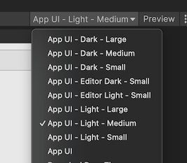
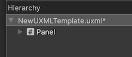
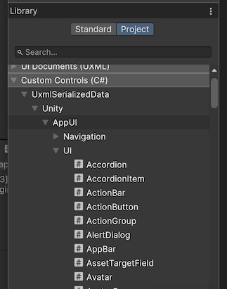
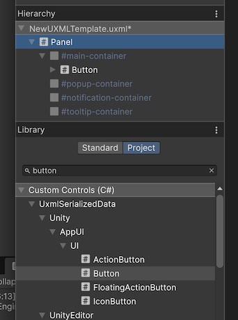
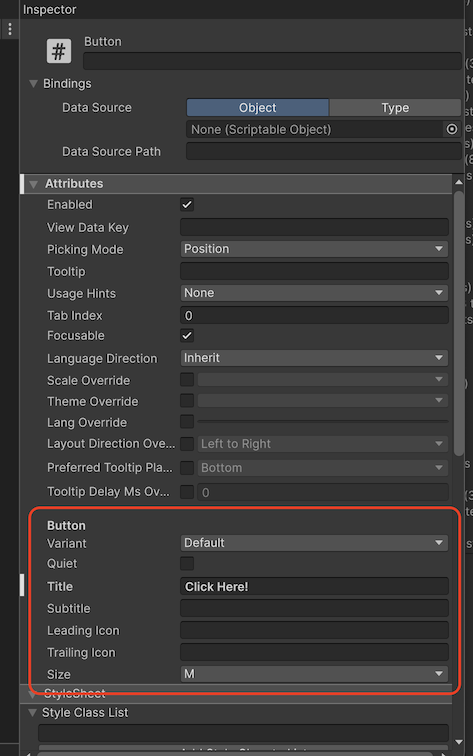
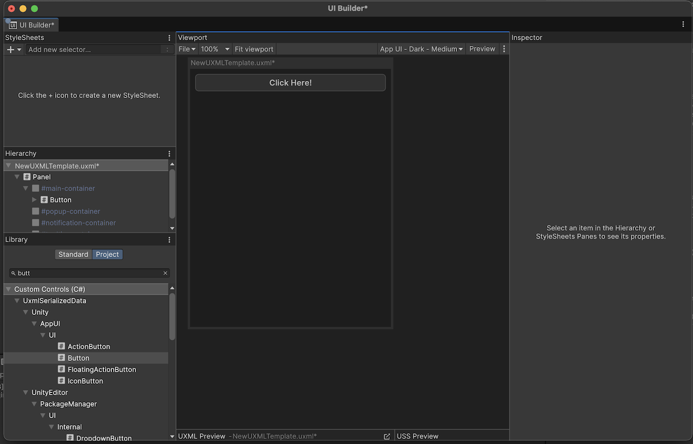
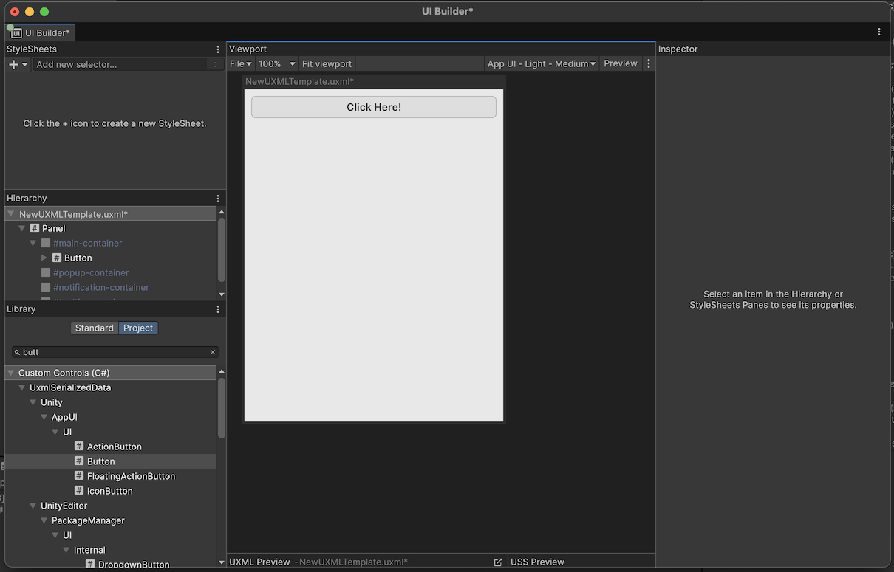

# Using App UI

Once you have installed App UI Unity Package, you can start using it in your Unity projects.

App UI Unity Package consists mainly of a set of [UI Toolkit](xref:UIElements) components.
If you are not familiar with UI Toolkit, we recommend you to read the [UI Toolkit documentation](xref:UIElements)
and the overall [Unity Documentation](https://docs.unity3d.com/Manual/index.html) before using App UI.

## App UI UI-Toolkit Themes

> [!NOTE]
> UI-Toolkit themes are files with the `.tss` extension which can be loaded in your [PanelSettings](xref:UnityEngine.UIElements.PanelSettings) component or selected in UI Builder via the theme dropdown in the viewport.

App UI comes with several UI-Toolkit themes that you can use in your projects. They are located in the `PackageResources/Styles/Themes` folder.

It is important to set a theme in your project.

<p align="center">
  
</p>

For more information about themes, see the [Theming documentation page](xref:theming).

### Default Theme

- `App UI.tss`: This is the main theme that encapsulates every [contexts](#root-panel-element) via different USS selectors. We recommend to use this theme if you are building a runtime app that needs to be able to switch between different color schemes, scales, layout directions, etc.

### Themes for UI Builder

Theses themes are designed to be used with the UI Builder, they are the combination styling related contexts (color scheme and scale).

- `App UI - Dark - Large.tss`
- `App UI - Dark - Medium.tss`
- `App UI - Dark - Small.tss`
- `App UI - Light - Large.tss`
- `App UI - Light - Medium.tss`
- `App UI - Light - Small.tss`
- `App UI - Editor Dark - Large.tss`
- `App UI - Editor Dark - Medium.tss`
- `App UI - Editor Dark - Small.tss`
- `App UI - Editor Light - Large.tss`
- `App UI - Editor Light - Medium.tss`
- `App UI - Editor Light - Small.tss`

## Root Panel Element

App UI components are designed to be used inside a [`Panel`](xref:Unity.AppUI.UI.Panel) component.
The [`Panel`](xref:Unity.AppUI.UI.Panel) component is a [`VisualElement`](xref:UnityEngine.UIElements.VisualElement) that provides an initial context to the [UIDocument](xref:UnityEngine.UIElements.UIDocument) which will be propagated to its children. Having a context is vital for App UI components to be displayed correctly, as they provide information such as the current theme (color scheme), the language, layout direction, etc.

In addition to the context, the [`Panel`](xref:Unity.AppUI.UI.Panel) component also provides a layering system to handle popups, notifications, and tooltips (they will appear in the same [UIDocument](xref:UnityEngine.UIElements.UIDocument) as overlays).

To know more about Context management, see the [Context documentation page](xref:contexts).

Here is how to use the [`Panel`](xref:Unity.AppUI.UI.Panel) component in a [`UI Document`](xref:UnityEngine.UIElements.UIDocument):

```xml
<UXML xmlns="UnityEngine.UIElements" xmlns:appui="Unity.AppUI.UI">
    <appui:Panel>
        <!-- Your UI elements -->
    </appui:Panel>
</UXML>
```

## App UI Components

App UI components are defined as [`VisualElement`](xref:UnityEngine.UIElements.VisualElement) in [UI Toolkit](xref:UIElements).
You can find them in the `Unity.AppUI.UI` namespace.

If you are working directly by editing UXML files, we recommend to define the `appui` namespace inside.

```xml
<UXML xmlns="UnityEngine.UIElements" xmlns:appui="Unity.AppUI.UI">
    [...]
</UXML>
```

You can also update the UXML Schema definition to get autocompletion in your IDE by selecting **Assets > Update UXML Schema** in the Editor.

Here is an example of usage inside a [`UI Document`](xref:UnityEngine.UIElements.UIDocument):

```xml
<UXML xmlns="UnityEngine.UIElements" xmlns:appui="Unity.AppUI.UI">
    <appui:Panel>
        <appui:Button title="Hello World!" />
    </appui:Panel>
</UXML>
```

<p align="center">
  
</p>

## Using App UI with UI Builder

UI Builder is Unity's visual authoring tool for UI Toolkit. App UI components are fully compatible with UI Builder, allowing you to create interfaces visually while leveraging all the design system components.

### Setting Up UI Builder for App UI

#### 1. Configure the Theme

Before building your interface, you need to select an appropriate App UI theme in UI Builder:

1. Open UI Builder (**Window > UI Toolkit > UI Builder**)
2. In the viewport area, click on the **Theme** dropdown
3. Select one of the App UI themes based on your target appearance:
   - For runtime applications: Use the specific context themes (e.g., `App UI - Dark - Medium`)
   - For editor tools: Use the editor themes (e.g., `App UI - Editor Dark - Small`)

<p align="center">
  
</p>

#### 2. Start with a Panel Root

Always begin your UI hierarchy with an App UI Panel component:

1. In the **Library** section, choose **Project** tab.
2. Search for **Panel** element from App UI library.
3. Add the element into your **Hierarchy** by dragging and dropping it.

This Panel will serve as your root container and provide the necessary context for all App UI components

<p align="center">
  
</p>

#### 3. Access App UI Components

App UI components are available in the Library panel under the **Project** tab:

1. Open the **Library** panel (if not visible, enable it via **Window > UI Builder**)
2. Choose the **Project** tab.
3. Expand the **Custom Controls (C#)** section to see all available components.

<p align="center">
  
</p>

### Building Interfaces with App UI Components

#### Adding Components

To add App UI components to your interface:

1. Drag components from the **Library** panel into the **Hierarchy**
2. Drop them inside your Panel or other container elements
3. Use the **Inspector** to configure component properties

<p align="center">
  
</p>

#### Component Properties

App UI components expose their properties in the Inspector panel:

- **Common Properties**: All components inherit standard VisualElement properties
- **App UI Properties**: Component-specific properties like `title`, `variant`, `size`, etc.
- **Styling**: USS classes and inline styles can be applied as usual

<p align="center">
  
</p>

### Best Practices for UI Builder

#### Preview Different Themes

Use the theme dropdown in UI Builder to preview your interface with different App UI themes:

- Test both light and dark variants
- Verify your layout works across different scale sizes
- Ensure proper contrast and readability

<p align="center">
  
  
</p>

#### Utilize the Visual Documentation

App UI includes visual documentation that can help you understand component behavior:

- Access component examples in the Package Documentation
- Reference the visual documentation in the `Docs/` folder
- Use the samples as starting points for your designs

### Troubleshooting UI Builder Issues

#### Components Not Displaying Correctly

If App UI components don't appear as expected:

1. **Check Theme**: Ensure you've selected an App UI theme in the viewport
2. **Verify Panel**: Make sure your components are inside an App UI Panel
3. **Update Schema**: Run **Assets > Update UXML Schema** to ensure proper autocompletion

#### Missing Components in Library

If App UI components don't appear in the Library panel:

1. Ensure the App UI package is properly installed
2. Restart Unity and UI Builder
3. Check that the package is in the correct version

#### Styling Issues

If custom styling isn't working as expected:

1. Verify USS specificity rules
2. Check that your styles don't conflict with App UI's base styles
3. Use the Inspector's computed styles to debug style application
