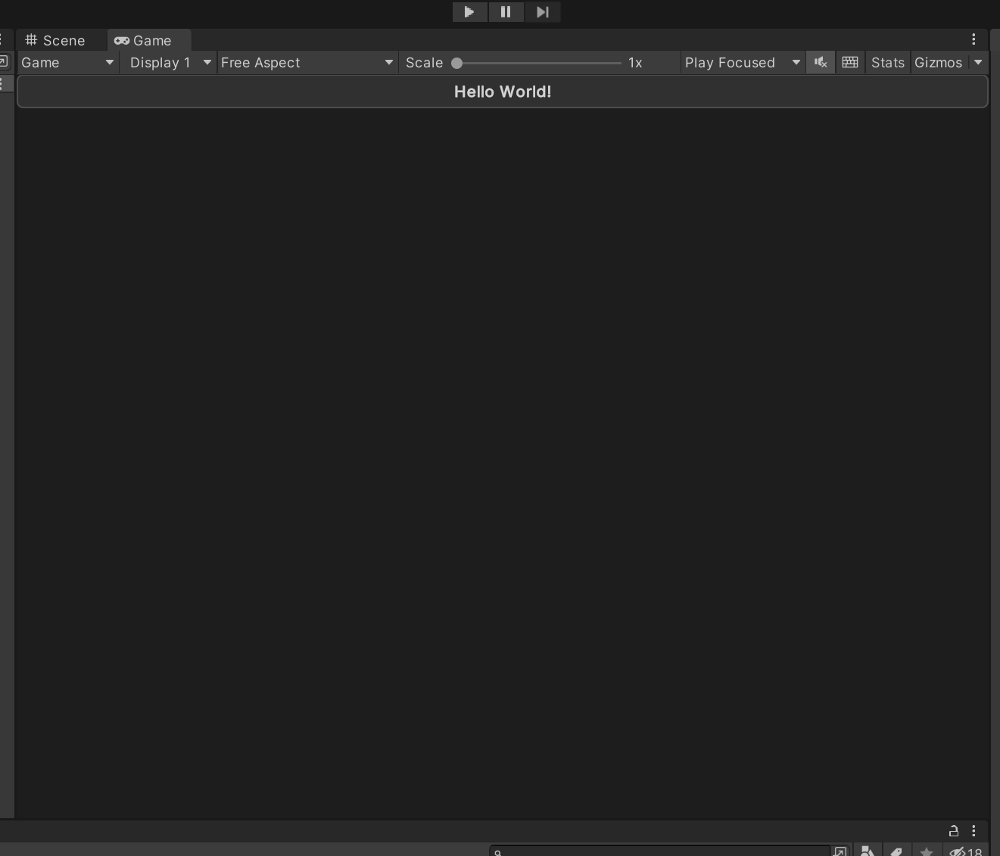

# Using App UI

Once you have installed App UI Unity Package, you can start using it in your Unity projects.

App UI Unity Package consists mainly of a set of [UI Toolkit](xref:UIElements) components.
If you are not familiar with UI Toolkit, we recommend you to read the [UI Toolkit documentation](xref:UIElements)
and the overall [Unity Documentation](https://docs.unity3d.com/Manual/index.html) before using App UI.

## App UI UI-Toolkit Themes

> [!NOTE]
> UI-Toolkit themes are files with the `.tss` extension which can be loaded in your [PanelSettings](xref:UnityEngine.UIElements.PanelSettings) component or selected in UI Builder via the theme dropdown in the viewport.

App UI comes with several UI-Toolkit themes that you can use in your projects. They are located in the `PackageResources/Styles/Themes` folder.

It is important to set a theme in your project.

<p align="center">
  
</p>

For more information about themes, see the [Theming documentation page](xref:theming).

### Default Theme

- `App UI.tss`: This is the main theme that encapsulates every [contexts](#root-panel-element) via different USS selectors. We recommend to use this theme if you are building a runtime app that needs to be able to switch between different color schemes, scales, layout directions, etc.

### Themes for UI Builder

Theses themes are designed to be used with the UI Builder, they are the combination styling related contexts (color scheme and scale).

- `App UI - Dark - Large.tss`
- `App UI - Dark - Medium.tss`
- `App UI - Dark - Small.tss`
- `App UI - Light - Large.tss`
- `App UI - Light - Medium.tss`
- `App UI - Light - Small.tss`
- `App UI - Editor Dark - Large.tss`
- `App UI - Editor Dark - Medium.tss`
- `App UI - Editor Dark - Small.tss`
- `App UI - Editor Light - Large.tss`
- `App UI - Editor Light - Medium.tss`
- `App UI - Editor Light - Small.tss`

## Root Panel Element

App UI components are designed to be used inside a [`Panel`](xref:Unity.AppUI.UI.Panel) component.
The [`Panel`](xref:Unity.AppUI.UI.Panel) component is a [`VisualElement`](xref:UnityEngine.UIElements.VisualElement) that provides an initial context to the [UIDocument](xref:UnityEngine.UIElements.UIDocument) which will be propagated to its children. Having a context is vital for App UI components to be displayed correctly, as they provide information such as the current theme (color scheme), the language, layout direction, etc.

In addition to the context, the [`Panel`](xref:Unity.AppUI.UI.Panel) component also provides a layering system to handle popups, notifications, and tooltips (they will appear in the same [UIDocument](xref:UnityEngine.UIElements.UIDocument) as overlays).

To know more about Context management, see the [Context documentation page](xref:contexts).

Here is how to use the [`Panel`](xref:Unity.AppUI.UI.Panel) component in a [`UI Document`](xref:UnityEngine.UIElements.UIDocument):

```xml
<UXML xmlns="UnityEngine.UIElements" xmlns:appui="Unity.AppUI.UI">
    <appui:Panel>
        <!-- Your UI elements -->
    </appui:Panel>
</UXML>
```

## App UI Components

App UI components are defined as [`VisualElement`](xref:UnityEngine.UIElements.VisualElement) in [UI Toolkit](xref:UIElements).
You can find them in the `Unity.AppUI.UI` namespace.

If you are working directly by editing UXML files, we recommend to define the `appui` namespace inside.

```xml
<UXML xmlns="UnityEngine.UIElements" xmlns:appui="Unity.AppUI.UI">
    [...]
</UXML>
```

You can also update the UXML Schema definition to get autocompletion in your IDE by selecting **Assets > Update UXML Schema** in the Editor.

Here is an example of usage inside a [`UI Document`](xref:UnityEngine.UIElements.UIDocument):

```xml
<UXML xmlns="UnityEngine.UIElements" xmlns:appui="Unity.AppUI.UI">
    <appui:Panel>
        <appui:Button title="Hello World!" />
    </appui:Panel>
</UXML>
```

<p align="center">
  
</p>
